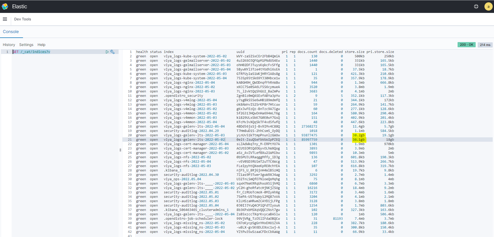
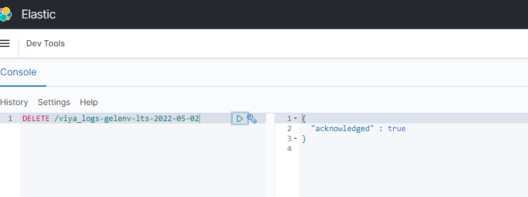
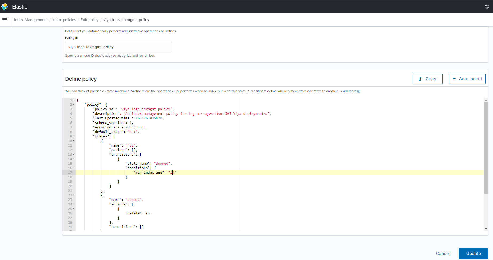

# How to purge Kibana ElasticSearch indexes (Viya logging indexes)

## Check the space used by the v4m logging

The logging ES indexes/db can lot of space in the NFS server.

```sh
[cloud-user@pdcesx21046 kubedata]$ cd /srv/nfs/kubedata
[cloud-user@pdcesx21046 kubedata]$ sudo du -sh * | grep G
2.8G    gelenv-lts-cas-default-data-pvc-3a9d944e-cf1c-4700-a3fa-90d11c87fb9b
2.8G    gelenv-lts-sas-cas-backup-data-pvc-9b0fc68c-0dfe-4814-be55-198313ef0f9c
17G     gelenv-lts-sas-commonfiles-pvc-1d291486-abd6-4b8f-af23-72b0f6b7abe4
8.5G    gelenv-lts-sas-crunchy-data-postgres-datanode-0-pvc-38333b5f-cf7e-41a5-9b0c-59670eb439fb
8.5G    gelenv-lts-sas-crunchy-data-postgres-datanode-1-pvc-18b455e0-97ed-4b8c-b966-64fbc560edb9
8.5G    gelenv-lts-sas-crunchy-data-postgres-pvc-c9571922-4693-487d-a3c8-a2eaa69a3cdc
28G     v4mlog-data-v4m-es-data-0-pvc-d8cb7a76-23c2-48cd-bee7-202904a4b123
37G     v4mlog-data-v4m-es-data-1-pvc-0c577b85-6e84-43d4-aa58-2ad02db60694
27G     v4mlog-data-v4m-es-data-2-pvc-8e35c602-7b59-41b0-b1c7-f5bc7527e16c
6.4G    v4mmon-prometheus-v4m-prometheus-db-prometheus-v4m-prometheus-0-pvc-2dfb2f78-e8fe-480d-81ec-3676a1b82410
```

## Manually removing log indices (with the UI)

Follow the procedure to remove the biggest indices.

1. Log in the Kibana console (for example : http://kibana.pdcesx21046.race.sas.com/ with `admin/lnxsas`)
1. Click on "Dev Tools"
1. Run the following commmand

    ```sh
    GET /_cat/indices?v
    ```

1. You should see something like :

    

1. Identify the indice you want to delete and type

    ```sh
    DELETE /{indice name}
    ```

1. You should see something like :

    

1. Check again
   1. with the `GET /_cat/indices?v` REST API call
   1. with the `du` command

    ```sh
    sudo du -xsch /srv/nfs/kubedata/* | grep G
    ```

## Adjusting the retention policy (with the UI)

* See the steps documented [there](https://github.com/sassoftware/viya4-monitoring-kubernetes/blob/ebbf4f18afd237c900dd054f662b541b5e3359d2/logging/Log_Retention.md#Adjusting-the-Retention-Policy)

* Example, to change the default retention period from 3 days to 1 day:

    
